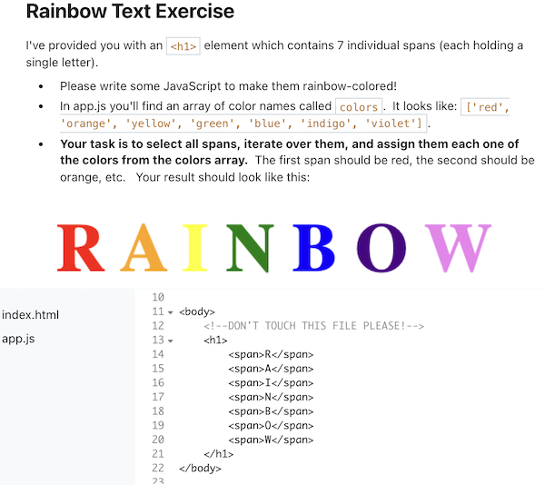

# 🌈 Rainbow Text Simulator 

The rainbow text simulator features a stormy weather background with the quote "Weather the storm, and you will see the rainbow". A cute rainbow cursor will appear when one hovers over the word *rainbow*, which will then change *rainbow*'s text color and font style, as well as replacing the background with a rainbow image. The newly applied effects will be removed after 3s.

## 🎉 Demo 

## ✨ Inspiration

This is my very first DOM manipulation mini project! 🌈 Inspired by a rainbow text exercise, in which I was asked to iterate over some text in an HTML file and make them rainbow-colored using JavaScript, I came up with the idea of making a project with more visually stimulating effects than simply changing the text color. 

When implementing the features I envisioned, I incoporated the practice of creating, prepending, and removing elements in the DOM, as well as attaching and experimenting with different event handlers. I also spent a lot of time googling and reading documentations for some issues I ran into (e.g. right element was selected but it returned null when I added event handler to it -- and it turned out that the script was excuted before page loaded because I placed the script before the body element) and ideas I didn't know how to put into action at the moment (e.g. customize a cursor). It was a fulfilling and rewarding learning experience!

## 👏 Credits

Storm background photo by <a href="https://unsplash.com/@wackeltin_meem?utm_source=unsplash&utm_medium=referral&utm_content=creditCopyText">Valentin Müller</a> on <a href="https://unsplash.com/s/photos/storm?utm_source=unsplash&utm_medium=referral&utm_content=creditCopyText">Unsplash</a>

Rainbow background photo by <a href="https://unsplash.com/@matcfelipe?utm_source=unsplash&utm_medium=referral&utm_content=creditCopyText">Mateus Campos Felipe</a> on <a href="https://unsplash.com/s/photos/rainbow?utm_source=unsplash&utm_medium=referral&utm_content=creditCopyText">Unsplash</a>

Rainbow Text Exercise by Colt Steele on Udemy:

